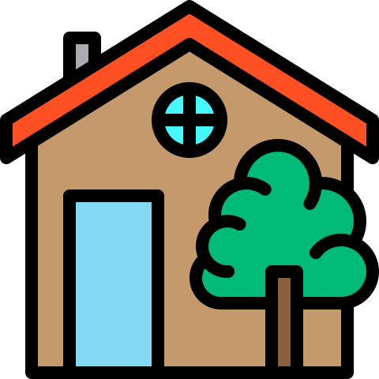
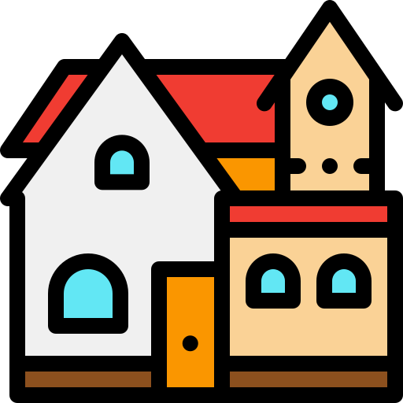
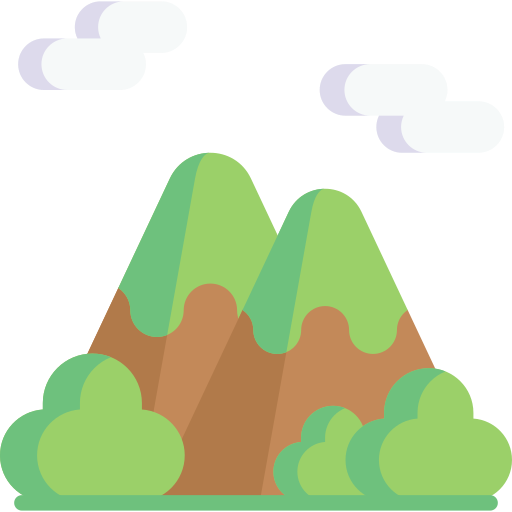

## Atribuciones

Algunos de los iconos e imágenes utilizados son de fuentes externas que requieren atribución, es decir, de otros artistas que publican su trabajo para que los usuarios lo descarguen y utilicen a cambio de señalar el enlace a su trabajo.

----------------------------------------------------------------------

## Listado de iconos

**SVG: Pueblo 1, Pueblo 2 y Montaña**  

----------------------------------------------------------------------

## Autores de los iconos

- [Flaticon/srip](https://www.flaticon.es/autores/srip)
  - Pueblo 1
- [Freepik](https://www.freepik.com)
  - Pueblo 2
  - Montaña
